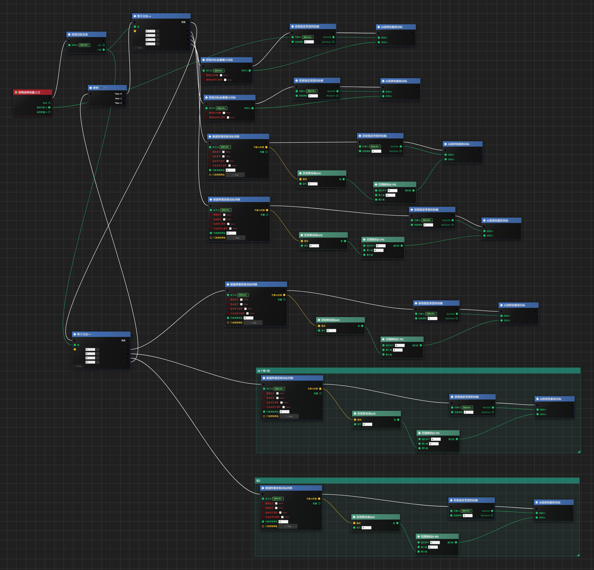

# OriginBlueprint

[English README](README.md)

OriginBlueprint 是一个以桌面端为主的可视化蓝图编辑器，技术栈为 Go、Wails v2、Vue 3、TypeScript 和 Rete.js v2。它用于编辑历史 `.vgf` 蓝图，同时支持新的 `.obp` 蓝图文件和 `.obpf` 函数蓝图文件。



## 功能概览

- 支持节点图编辑：平移、缩放、框选、复制/剪切/粘贴、撤销/重做、节点组、对齐、切断连线。
- 支持打开并尽量保留历史 `.vgf` 文件，包括未知旧节点和旧连线。
- 支持保存原生 `.obp` 蓝图文档和 `.obpf` 函数蓝图文档。
- 从 `nodes/` 目录下的 JSON 文件加载自定义节点库。
- 桌面版支持工程文件浏览器、最近文件、在资源管理器中定位、刷新节点库。
- 支持蓝图校验：缺少入口、端口不存在、端口类型不匹配、不可达执行流、潜在执行循环等。
- 支持导出选中节点或整张蓝图为 PNG 图片。
- 菜单和界面支持中文、英文切换。

## 文件类型

| 文件 | 用途 |
| --- | --- |
| `.vgf` | 历史蓝图 JSON。编辑器会进行迁移并尽量保留旧内容。 |
| `.obp` | OriginBlueprint 原生蓝图文档。 |
| `.obpf` | OriginBlueprint 原生函数蓝图文档。 |
| `originblueprint.project` | 工程级编辑器设置，例如窗口布局宽度、语言、界面偏好。 |
| `nodes/**/*.json` | 节点定义文件，会被加载到模块库中。 |

## 快速开始

桌面开发：

```powershell
wails dev
```

只开发前端：

```powershell
cd frontend
npm install
npm run dev
```

构建和验证：

```powershell
go test ./...
cd frontend
npm run test:layout
npm run build
```

构建桌面可执行文件：

```powershell
wails build
```

## 基本使用

1. 启动应用。
2. 通过 **文件 > 打开工程目录** 选择项目目录。
3. 在左侧文件浏览器中打开 `.vgf`、`.obp` 或 `.obpf` 文件。
4. 从右侧模块库拖拽节点到画布。
5. 连接兼容端口。执行端口表示流程顺序，数据端口表示类型化的值。
6. 在变量面板中创建变量和变量分组。
7. 点击 **Test / 测试** 校验蓝图结构。
8. 使用 `Ctrl+S` 保存，或使用 **另存为** 选择新文件路径。

常用快捷键：

| 快捷键 | 功能 |
| --- | --- |
| `Ctrl+S` | 保存当前蓝图 |
| `Ctrl+Shift+S` | 另存为 |
| `Ctrl+A` | 全选 |
| `Ctrl+D` | 取消选择 |
| `Ctrl+C / Ctrl+X / Ctrl+V` | 复制、剪切、粘贴 |
| `Ctrl+Z / Ctrl+Y` | 撤销、重做 |
| `Ctrl+G` | 创建节点组；选中节点组时取消分组 |
| `Ctrl+Shift+Q` | 在系统文件管理器中定位当前或选中的蓝图文件 |
| `Ctrl+Alt+R` | 导出选中节点为 PNG |
| `Ctrl+Shift+R` | 导出整张蓝图为 PNG |

## 工程目录规则

推荐的工程结构：

```text
ProjectRoot/
  originblueprint.project
  nodes/
    MyGameplayNodes.json
    combat/
      DamageNodes.json
  blueprints/
    battle.vgf
    skill.obp
  functions/
    calculate_damage.obpf
```

规则说明：

- 如果需要文件浏览器、节点库和工程设置，请打开工程根目录，而不是只打开单个蓝图文件。
- 自定义节点 JSON 放在 `nodes/` 下任意层级，加载器会递归扫描。
- 蓝图文件可以按业务习惯放在任意目录。文件浏览器会显示 `.vgf`、`.obp`、`.obpf`。
- `originblueprint.project` 放在工程根目录，用于保存该工程的编辑器偏好。
- 不建议手动维护构建产物。`frontend/dist/` 和打包输出应视为可重新生成的文件。

## 自定义节点 JSON

新增节点直接使用当前显式节点定义格式。这个格式使用稳定的节点 `id` 和命名端口 `key`，比旧的数字端口编号更适合维护。

旧节点 JSON 仍可为了兼容历史项目继续导入，但新的说明和新项目建议统一使用下面的格式。

### 节点示例

```json
{
  "id": "origin.example.clamp-integer",
  "title": "限制整数范围",
  "category": "运算",
  "subtitle": "将整数限制在最小值和最大值之间。",
  "inputs": [
    { "key": "value", "label": "值", "type": "data", "data_type": "Integer", "defaultValue": 0 },
    { "key": "min", "label": "最小值", "type": "data", "data_type": "Integer", "defaultValue": 0 },
    { "key": "max", "label": "最大值", "type": "data", "data_type": "Integer", "defaultValue": 100 }
  ],
  "outputs": [
    { "key": "result", "label": "结果", "type": "data", "data_type": "Integer" }
  ]
}
```

字段说明：

- `id`：稳定的节点类型 ID。用户保存包含该节点的蓝图后，不要随意修改。
- `title`：模块库和节点标题显示文本。
- `category`：模块库分类。
- `subtitle`：可选说明文本。
- `inputs` / `outputs`：输入和输出端口列表。
- `key`：稳定端口 key，会写入图文档并用于运行时校验。
- `label`：端口显示文本。
- `type`：`exec` 表示执行端口，`data` 表示数据端口。
- `data_type`：常用类型包括 `Integer`、`Float`、`Boolean`、`String`、`Array`、`Any`。
- `defaultValue`：输入数据端口的可选默认值。
- `arrayItemType`：数组端口的可选输入控件类型，常用 `number` 或 `string`。

建议：

- 用户开始保存包含该节点的蓝图后，不要随意修改 `id`。
- 端口 `key` 使用稳定、可读的小写名称，例如 `exec`、`value`、`result`、`true`、`false`。
- 只有流程顺序需要使用 `exec` 端口。
- 值传递使用数据端口，并在需要内联输入时设置 `defaultValue`。
- 新增 JSON 节点只代表“可显示、可编辑、可连线”，并不会自动拥有 Go 运行时逻辑。

## 动态分支节点

如果节点需要通过 `+ Item` 同时增加左侧参数行和右侧执行出口，可以使用 `dynamicBranch`：

```json
{
  "id": "origin.flow.equal-switch-example",
  "title": "等于分支",
  "category": "流程",
  "inputs": [
    { "key": "exec", "label": "", "type": "exec" },
    { "key": "value", "label": "值", "type": "data", "data_type": "Integer", "defaultValue": 0 },
    { "key": "cases", "label": "分支值", "type": "data", "data_type": "Array", "defaultValue": [], "arrayItemType": "number" }
  ],
  "outputs": [
    { "key": "otherwise", "label": "否则", "type": "exec" },
    { "key": "case1", "label": "", "type": "exec" },
    { "key": "case2", "label": "", "type": "exec" }
  ],
  "dynamicBranch": {
    "controlInput": "cases",
    "defaultOutput": "otherwise",
    "outputPrefix": "case",
    "outputStartIndex": 1,
    "maxBranches": 2
  }
}
```

含义：

- `controlInput`：控制动态分支数量的数组输入端口 key。
- `defaultOutput`：不随 `+ Item` 增减的默认执行出口。
- `outputPrefix` 和 `outputStartIndex`：右侧动态执行出口 key 的生成规则。
- `maxBranches`：最大动态分支数。对应的输出端口仍建议在 `outputs` 中预先声明。
- `arrayItemType`：动态参数输入框类型，常用 `number` 或 `string`。

## Go 接入说明

编辑器的持久化数据契约是 `graph.go` 中的 `GraphDocument`。不要把 Rete.js 内部结构直接作为保存文件格式。

重要 Go 文件：

| 文件 | 职责 |
| --- | --- |
| `graph.go` | `GraphDocument`、校验、稳定的内置节点端口定义。 |
| `legacy.go` | 历史 `.vgf` 迁移和导出兼容。 |
| `node_schemas.go` | 加载 `nodes/**/*.json` 节点定义文档。 |
| `execution.go` | Go 运行时执行语义。 |
| `app.go` | 暴露给 Wails 的文件、工程、项目设置、图片导出和系统能力服务。 |

新增一个可执行节点时，通常需要：

1. 在 `nodes/` 下新增或更新节点 JSON。
2. 如果该节点需要作为已知运行时节点参与校验，在 `graph.go` 中补充稳定端口定义。
3. 如果该节点需要在 Go 运行时执行，在 `execution.go` 中实现对应逻辑。
4. 如果需要兼容历史 `.vgf` 导入导出，同步更新 `legacy.go` 和 `frontend/src/editor/runtimeNodeSchemas.ts` 的映射。
5. 为校验、迁移、执行或 round-trip 行为增加 Go 测试。

最小执行链路：

```text
GraphDocument JSON
  -> Go 校验 / 迁移
  -> executeGraph(...)
  -> ExecutionEvent 日志、结果、变量和节点状态
```

前端负责实时画布交互，Go 负责持久化兼容、校验、迁移和运行时执行规则。

## 网页版兼容性

前端可以作为 Vite 网页应用构建，但当前产品仍以桌面版为主。

浏览器构建当前可用：

- 创建和编辑原生蓝图文档。
- 通过浏览器文件选择器打开 `.obp`、`.obpf` 或 JSON 文件。
- 通过下载方式保存原生 JSON 图文档。
- 从 `nodes/manifest.json` 加载静态节点库。
- 通过浏览器下载导出蓝图图片。

当前仅桌面版可用：

- 原生工程目录扫描。
- 最近文件和在资源管理器中定位。
- 通过 Go 服务进行历史 `.vgf` 迁移和 legacy 导出。
- Go 侧蓝图校验和运行时服务。
- 原生文件对话框和 Wails 窗口控制。

## 兼容性注意事项

- 未知旧节点和旧边应尽量保留，不要静默丢弃。
- `.vgf` round-trip 风险较高，修改迁移或导出逻辑时应使用代表性旧文件测试。
- 新节点 ID、端口 key、数据类型一旦写入图文档，就应视为稳定契约。
- 如果新节点需要被旧外部解析器使用，需要提供明确的 legacy 导出映射。

## 更多文档

- [架构说明](docs/ARCHITECTURE.md)
- [节点 JSON 格式](docs/NODE_JSON_FORMAT_ZH.md)
- [Legacy 兼容说明](docs/LEGACY_COMPATIBILITY_ZH.md)
- [蓝图修改安全规则](docs/BLUEPRINT_CHANGE_SAFETY_ZH.md)
- [Go 引擎测试矩阵](docs/BLUEPRINT_ENGINE_TEST_MATRIX_ZH.md)
